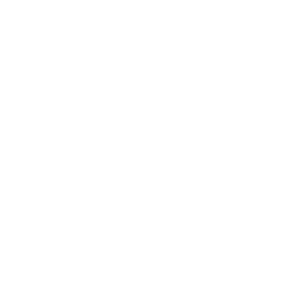

<!-- Hero Section -->
<!-- <section class="hero">
  <h1 class="sr-only">Welcome to Women Techmakers Vienna</h1>
</section> -->

<section class="hero hero-after">
  
  
    <h1 class="sr-only">Welcome to Women Techmakers Vienna</h1>
    
This was

    <h2>International Women's Day 2025</h1>
    
On April 09, an online event with 5 amazing women took place from 6pm-8pm.

  

</section>

<section class="hero-content">
  
  
    <!-- 
April 09, 2025

    
18:00 - 20:00 CET
 -->
    

      <iframe 
        title="International Women’s Day (IWD) 2025: Redefine Possible | Virtual, April 09, 2025"
        style="aspect-ratio: 16 / 9; width:100%;"
        src="https://www.youtube-nocookie.com/embed/aAXkw1UaEtg"
        allow="autoplay"
        allowfullscreen
        loading="lazy"
        srcdoc="&lt;style&gt;body{background-image:url(assets/images/banners/IWDSpeakers.png);background-repeat:no-repeat;background-size:cover;background-position:center center;display:grid;place-items:center;min-height:97dvh;overflow:hidden;}a{display:block;width:96px;height:96px;overflow:hidden;}a:focus{outline:none;}a:focus circle,a:hover circle{fill:#000;}a:focus circle:first-child + circle,a:hover circle:first-child + circle{stroke-dasharray:.4,.4;}a:focus polygon,a:hover polygon{stroke:#fff;stroke-width:.75;}&lt;/style&gt;&lt;a href='https://www.youtube-nocookie.com/embed/aAXkw1UaEtg?autoplay=1'&gt;&lt;svg viewBox='0 0 16 16' width='96' height='96' xmlns='http://www.w3.org/2000/svg' aria-hidden='true'&gt;&lt;circle cx='50%' cy='50%' r='7.75' fill='none' stroke='#000' stroke-width='.5'/&gt;&lt;circle cx='50%' cy='50%' r='7.25' fill='none' stroke='#fff' stroke-width='.5'/&gt;&lt;circle cx='50%' cy='50%' r='7' fill='#0009'/&gt;&lt;polygon points='12, 8 6, 4.5 6, 11.5' fill='#fff' stroke-linejoin='round'&gt;&lt;/polygon&gt;&lt;/svg&gt;Play&lt;/a&gt;">
      </iframe>
    

    <a href="https://drive.google.com/drive/folders/19pulyMbak1Hm3YNLuV3dFli4VWpcdp3f?usp=sharing">Event Slides in Google Drive</a>
  

</section>

<!-- About Section -->
<section class="about">
  

    <h2>About Women Techmakers Vienna</h2>
      

        Based in the heart of Vienna, Women Techmakers Vienna is a vibrant community dedicated to empowering women and people with disabilities in tech. We celebrate the innovative work and unique contributions of underrepresented voices in the technology field while fostering an inclusive environment where every individual can thrive. Join us as we share inspiring stories, host engaging events, and advocate for equality, diversity, and innovation in tech.

        People of all genders and abilities are welcome to attend our event.
        We try to focus on the accomplishments of technologists that also happen to be women or a person with a disability, rather than just focusing on the story of doing something as a woman or a person with a disability. This helps the focus be more of the work rather than our gender or abilities.

        We aim to keep things positive when selecting panels, talks, keynotes, etc. We know that we need more women and people with disabilities in tech and inclusive workplaces and there are issues we face in the industry, but one of the most powerful things we can do to counter act that is to show that women and people with disabilities doing great things and what we are achieving.

  

  

    

      <h3>Conference</h3>
      
      
Supporting women and people with disabilities in tech through the power of example.

    

    

      <h3>Discussion</h3>
      
      
How can we close the gender gap in science, tech, engineering &amp; mathematics? On-stage panel discussion with experts and leaders.

    

    

      <h3>Hackathon</h3>
      
      
High-tech workshops, hands-on experience, hacking and debugging. Delivered by top women in tech!

    

  

</section>

<!-- About Section -->
<section class="values">
  

    <h2>What we stand for</h2>
    

      

      
        <h3>Mission</h3>
        

          Our mission is to empower women and people with disabilities in Vienna’s tech community by creating opportunities for learning, innovation, and growth. We host engaging events and workshops that foster mentorship and skill development, ensuring every individual can access the resources they need.

           Through advocacy and collaboration, we strive to break down barriers and inspire meaningful change in the STEM landscape.
        

      

      

      
        <h3>Values</h3>
        

          We believe in the power of inclusivity, respect, and collaboration as the cornerstones of progress in technology. Our values are reflected in our commitment to transparency, continuous learning, and mutual support, ensuring every voice is celebrated.

          By embracing diversity and fostering a culture of innovation, we create a community where everyone can thrive and contribute to a brighter future.
        

      

      

    
        <h3>Vision</h3>
        

          Our vision is to transform Vienna into a leading center for inclusive innovation in the tech industry. We envision a future where gender, ability, and background are celebrated as strengths, and where opportunities in STEM are accessible to all.

          Through strategic partnerships and creative problem-solving, we aspire to inspire global change and redefine success in technology.

  

</section>

<!-- Partners/Sponsors Section -->
<section class="partners">
  

  <h2>Organizers</h2>
  

    We extend our heartfelt thanks to our dedicated organizers and supportive partners for making our events a success and empowering women and people with disabilities in tech.
  

  <h3>Main Organizers</h3>
  

    

      
    

    

      
    

    

      
    

  

  <h2>Partners</h2>
  <a href="/become-a-partner/" class="btn">Become a partner</a>
  <!-- <h3>Platinum Partners</h3>
  

    

      
    

    

      
    

  

  <h3>Gold Partners</h3>
  

    

      
    

    

      
    

  

  <h3>General Partners</h3>
  

    

      
    

    

      
    

  
 -->

</section>
